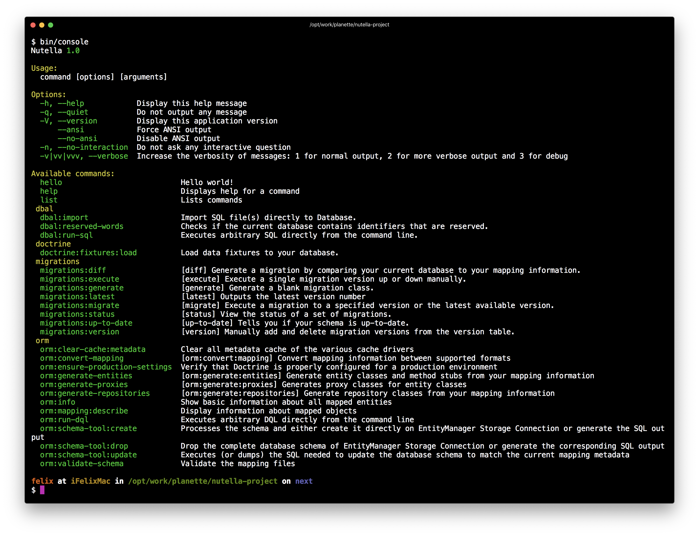

<p align=center>
	<a href="https://github.com/contributte/doctrine-fixtures/actions"></a>
	<a href="https://coveralls.io/r/nettrine/fixtures"></a>
	<a href="https://packagist.org/packages/nettrine/fixtures"></a>
	<a href="https://packagist.org/packages/nettrine/fixtures"></a>
</p>
<p align=center>
	<a href="https://packagist.org/packages/nettrine/fixtures"></a>
	<a href="https://github.com/contributte/doctrine-fixtures"></a>
	<a href="https://bit.ly/ctteg"></a>
	<a href="https://bit.ly/cttfo"></a>
	<a href="https://contributte.org/partners.html"></a>
</p>

<p align=center>
Website 🚀 <a href="https://contributte.org">contributte.org</a> | Contact 👨🏻‍💻 <a href="https://f3l1x.io">f3l1x.io</a> | Twitter 🐦 <a href="https://twitter.com/contributte">@contributte</a>
</p>

Doctrine DataFixtures integration for Nette Framework applications.

## Versions

| State  | Version | Branch   | Nette  | PHP     |
|--------|---------|----------|--------|---------|
| dev    | `^0.9`  | `master` | `3.2+` | `>=8.2` |
| stable | `^0.8`  | `master` | `3.2+` | `>=8.2` |

## Content

- [Installation](#installation)
- [Configuration](#configuration)
- [Usage](#usage)
- [Examples](#examples)
- [Development](#development)

## Installation

Install the package using Composer.

```bash
composer require nettrine/fixtures
```

Register prepared [compiler extension](https://doc.nette.org/en/dependency-injection/nette-container) in your `config.neon` file.

```neon
extensions:
	nettrine.fixtures: Nettrine\Fixtures\DI\FixturesExtension
```

> [!NOTE]
> This is just **Fixtures**, for **ORM** use [nettrine/orm](https://github.com/contributte/doctrine-orm) or **DBAL** use [nettrine/dbal](https://github.com/contributte/doctrine-dbal).

## Configuration

### Minimal Configuration

```neon
nettrine.fixtures:
	paths:
		- %appDir%/fixtures
```

### Advanced Configuration

Here is the list of all available options with their types.

```yaml
nettrine.fixtures:
	paths: <string[]>
```

## Usage

### Console

Type `bin/console` in your terminal and there should be a `doctrine:fixtures` command group.

```sh
bin/console doctrine:fixtures:load
bin/console doctrine:fixtures:load --fixtures=db/fixtures/development
```

By default, the fixtures are appended to the database. If you want to delete all data before loading fixtures, use `--purge` option.

```sh
bin/console doctrine:fixtures:load --purge=truncate
bin/console doctrine:fixtures:load --purge=delete
```



### Fixtures

The simplest fixture just implements **Doctrine\Common\DataFixtures\FixtureInterface**.

```php
use Doctrine\Common\DataFixtures\FixtureInterface;
use Doctrine\Common\Persistence\ObjectManager;

class Foo1Fixture implements FixtureInterface
{
	/**
	 * Load data fixtures with the passed ObjectManager.
	 */
	public function load(ObjectManager $manager): void
	{
	}
}
```

If you need to run the fixtures in a fixed succession, implement **Doctrine\Common\DataFixtures\OrderedFixtureInterface**.

```php
use Doctrine\Common\DataFixtures\FixtureInterface;
use Doctrine\Common\DataFixtures\OrderedFixtureInterface;
use Doctrine\Common\Persistence\ObjectManager;

class Foo2Fixture implements FixtureInterface, OrderedFixtureInterface
{
	/**
	 * Load data fixtures with the passed ObjectManager.
	 */
	public function load(ObjectManager $manager): void
	{
	}

	/**
	 * Get the order of this fixture.
	 */
	public function getOrder(): int
	{
		return 1;
	}
}
```

If you need to run the fixtures in a fixed order after some other fixture, implement **Doctrine\Common\DataFixtures\DependentFixtureInterface**.

```php
use Doctrine\Common\DataFixtures\DependentFixtureInterface;
use Doctrine\Common\DataFixtures\FixtureInterface;
use Doctrine\Common\Persistence\ObjectManager;

class Foo2Fixture implements FixtureInterface, DependentFixtureInterface
{
	/**
	 * Load data fixtures with the passed ObjectManager.
	 */
	public function load(ObjectManager $manager): void
	{
	}

	/**
	 * Get dependencies of this fixture.
	 */
	public function getDependencies(): array
	{
		return [Foo1Fixture::class];
	}
}
```

If you need to use referencing, extend **Doctrine\Common\DataFixtures\AbstractFixture**.

```php
use Doctrine\Common\DataFixtures\AbstractFixture;
use Doctrine\Common\Persistence\ObjectManager;

class Foo3Fixture extends AbstractFixture
{
	/**
	 * Load data fixtures with the passed ObjectManager.
	 */
	public function load(ObjectManager $manager): void
	{
		$this->addReference('user', new User());
		$this->getReference('user');
	}
}
```

If you need to use the Container, implement **Nettrine\Fixtures\ContainerAwareInterface**.

```php
use Doctrine\Common\DataFixtures\FixtureInterface;
use Doctrine\Common\Persistence\ObjectManager;
use Nette\DI\Container;
use Nettrine\Fixtures\ContainerAwareInterface;

class Foo4Fixture implements FixtureInterface, ContainerAwareInterface
{
	/** @var Container */
	private $container;

	public function setContainer(Container $container): void
	{
		$this->container = $container;
	}

	/**
	 * Load data fixtures with the passed ObjectManager.
	 */
	public function load(ObjectManager $manager): void
	{
		$this->container->getService('foo');
	}
}
```

### Services

To autoload your fixtures, register them as services in your `config.neon` file.

```neon
services:
	- App\Fixtures\Foo1Fixture
	- App\Fixtures\Foo2Fixture
	- App\Fixtures\Foo3Fixture
	- App\Fixtures\Foo4Fixture
```

## Examples

> [!TIP]
> Take a look at more examples in [contributte/doctrine](https://github.com/contributte/doctrine/tree/master/.docs).

## Development

See [how to contribute](https://contributte.org) to this package. This package is currently maintained by these authors.

<a href="https://github.com/f3l1x">
	
</a>

-----

Consider to [support](https://contributte.org/partners.html) **contributte** development team.
Also thank you for using this package.
